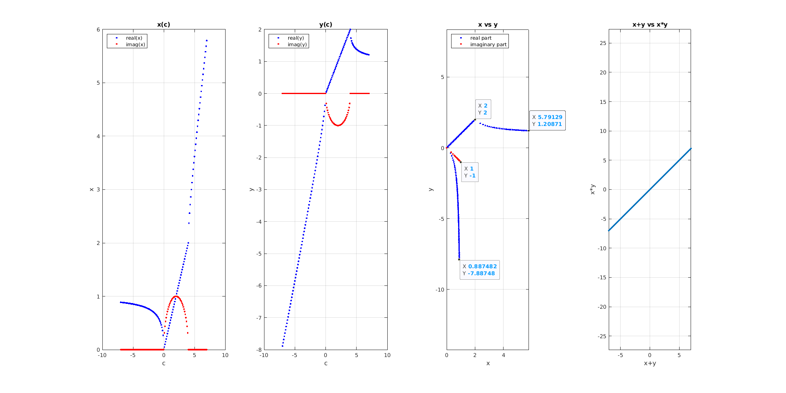

# SumEqualsProduct 

What numbers x, y have the property that their sum equals their product?
I.e.:

```
x + y = c
x * y = c
```

This script solves this problem and plots solution.





## What I have learnt? 

  * there are few integers that have this property; one can achieve it easier with imaginary numbers
  * how to plot both real and imaginary parts on the same plot
  * using plot3 function
  * adding more than one point label 
